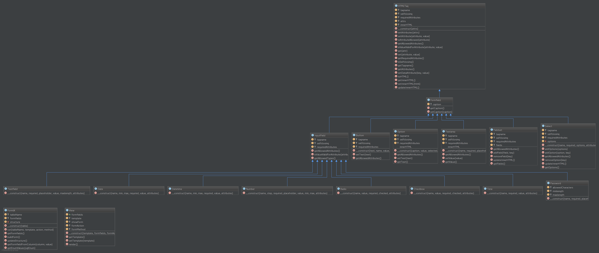

FormiX
======

## Infos
### Setup
Standart XAMPP-Konfiguration mit Default MySQL-Benutzer (root). Falls ein anderer Benutzer verwendet wird, muss
dieser in der Datei <code>inc/db.config.php</code> geändert werden.

### Struktur

Der eigentliche Formulargenerator befindet sich unter <code>lib/local/kije/FormiX</code>.
